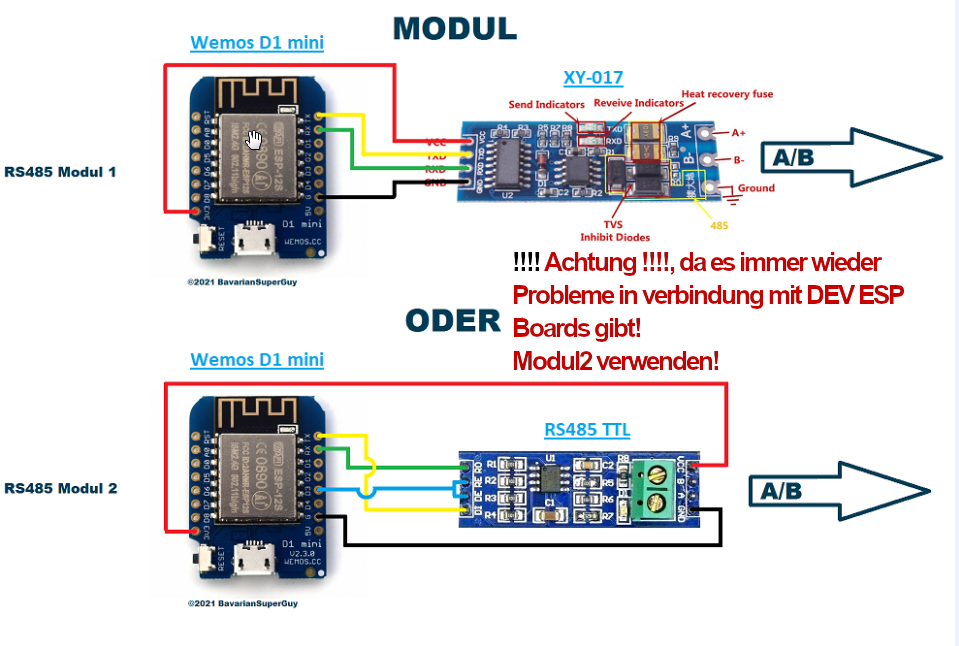
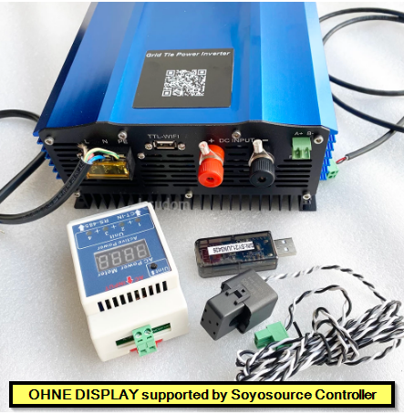
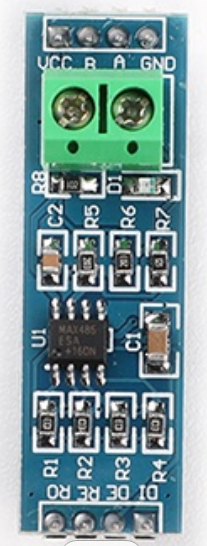
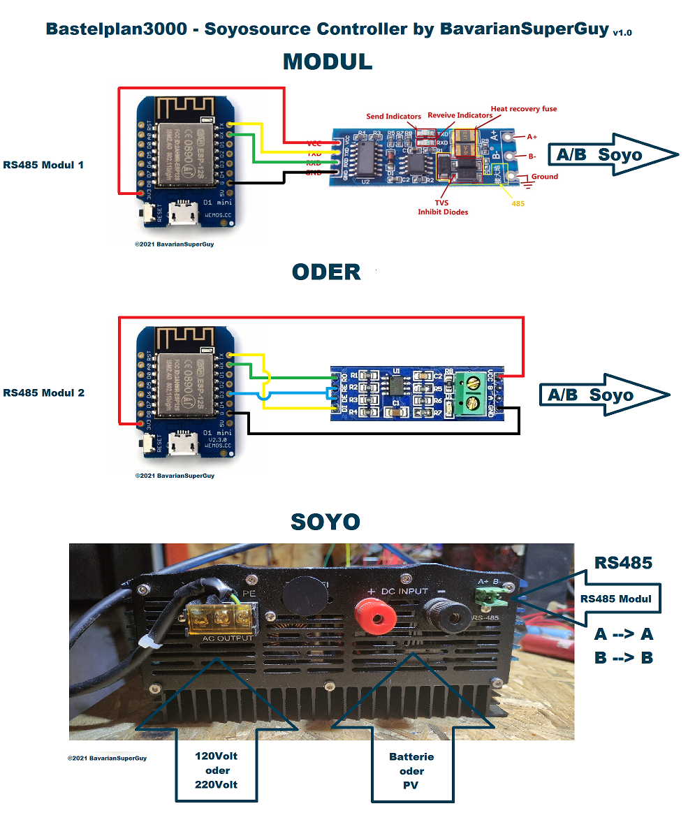

Explain: SUN1200BSG BluePill <- Codename for SolarAtomicBomb

Was nett wäre, Vergesst bitte nicht meinen Kanal zu abonnieren und zu liken ;-) ... wann disliken gut wär, dann das auch :-))

https://www.youtube.com/c/BavarianSuperGuy

Falls Ihr mich unterstützen wollt, Spenden sind herzlich willkommen und würde mich sehr freuen :-)
Hier bitte - https://paypal.me/BSGuy

Soyo Film-> https://youtu.be/TAW5yowh12U

Video zu 
v1.0.2.5 
Mehrere Soyo 
mit einem ESP -> https://youtu.be/sVKFAbERqqg

Ich übernehme keine Haftung für Schäden, die aufgrund der Nutzung 
der Software entstehen oder entstanden sind. 
Jeder ist für sein tun selber verantwortlich.
Mir sind keine Probleme bekannt.

Vorab zum ESP8266 ein Hinweis!
zu 100% Lauffähig ist die hier eingestellte Software mit einem ESP12 Modul!
Dieses ESP12 Modul gibt es als e,f oder s Variante.
Diese haben immer ein Abschirmblech verbaut und haben 4MByte(32Mbit) Ram!
In der Regel haben D1 minis oder NodeMcu Platinen das ESP12 Modul verbaut!
Diese funktionieren in der Regel auch gut aber die usbserial programmiereinrichtung 
die mit auf der platine zum ESP12 Modul verbaut wird , ist teils oer meist störanfällig!
Diese z.B. ch340 verbauten IC sind mit dem rx/tx des esp8266 im ESP12 Modul verbunden.
Die Entkopplung von RX/TX ist den D1/Node Platinen Herstellern nicht immer gelungen!

GANZ UNTEN IST DAS ANSCHLUSSSCHEMA (Bastelplan3000)

3 Dinge sind wichtig für die Umsetzung dieses Projekts:
- 3,3V
- Guter Wlan Empfang(Keine Leerzeichen in der SSID vom Router)
- Readme vollstandig lesen, dann nochmal
wann readme gelesen wurde und ihr daraufhin gemerkt habt
aufgrund der Methode die beschrieben wird ,
der wlan empfang ist schlecht und lässt sich nicht ändern

... https://www.google.com/search?q=esp8266+antennenhack

ich kann keinen besseren Empfang programmiern!
und der esp kann auch nix anderes machen 
wann er ständig versucht sich  ins Wlan einzuloggen

Internet Explorer wird nicht unterstützt!(die kochen wieder eigenes Sueppchen bei Slider funktion)

# EspSoyosourceController mit Webseite
Der Esp8266 ist über ein Rs485 Modul mit dem Soyosource 1200 Solar/Batterie Wechselrichter verbunden und kann diesem die Leistungswerte senden die er im Stromnetz ausgleichen/einspeisen soll. 
ManualMode: Der Leistungswert kann auf der Esp Webseite eingegeben und gesendet werden. 
AutoMode: Der Esp empfängt über Mqtt Topic oder WebInterface den LeistungsWert (z.B. der Wert einer Messeinrichtung über die 3 Phasen)
der gewünschten zu regelnden Leistung und regelt den Soyosource automatisch.

Kurzum die Firmware die es hier zum Download gibt, ersetzt den Limiter.

Die Firmware(firmware_vX.X.X.X.bin") ist im Verzeichnis espflasher.
Diese kann unkompliziert auf einen 4Mbyte Esp mit dem im Verzeichnis enhaltenen
Tool "FlashESP8266.exe" geflasht werden. 
Dieses Tool FlashESP8266.exe ist nicht von mir , aber hat schon hevorragende Dienste geleistet.
Es kann natürlich auch z.B. das Tasmotizer Firmware flash Tool zum aufspielen benutzt werden.
(Tasmotizer: Erase Checkbox nicht vergessen vor dem ersten flashen anzuhaken)

Was kann der ESP8266 Soyosource Controller :

- annähernd Nulleinspeisung

Grundlegend ist FAKT: wann der SOYO Wechselrichter keine Signale über Rs485 gesendet bekommt hört er auf einzuspeisen(Safety)!

- Der Esp nimmt die Leistung die er Regeln soll über Mqtt und Webschnittstelle auf.
- Zu übergebenes Zahlenformat 200 oder 200.00
- Der ESP nimmt die Leistung an und übergibt Sie dem Soyo , danach ist eine 3Sekunden Pause
- Erst dann wird der zuletzt empfangene Leistungswert dem Soyo übergeben dann wieder 3 sekunden Pause...
- Damit geschieht eine saubere einpendelung gegen ~0watt Verbrauch bzw. er regelt sich in einen vorgegebenen Toleranzbereich ein.
- In der ESP Web Seite(Ipaddresse des Esp im Browser eingeben) kann man per Button die Einspeisung beenden(Notaus), schicke explizit 0watt an SOYO , geht schneller als zu warten bis er selbst beendet da er anschliessend auch keine Signale mehr bekommt.
- In der Web Seite kann man per Button die maximale Einspeiseleistung eingestellt werden(MaxPower)
- Die blinkende Überschrift in der Webseite ist ein Alive zeichen , solange die Überschrift "ESP Herzschlag" blinkt , ist alles gut

- Wann der Soyosource einspeisst , blinkt die DCZeile in der Esp Webseite
ACHTUNG : seit einiger Zeit gibt es Geräte , die keine Status Daten über rs485 auf gewohntem Weg zurückgeben 
Hier blinkt die DC Zeile nicht und es wird auch nichts angezeigt in dieser Zeile 
aber die Regelung der Null-Einspeisung funktioniert trotzdem!

- Derzeit pendelt der Esp sich im Toleranz Bereich -20 |0| +5 Watt ein , geplant ist die Toleranzwerte einzustellen zu können wann jemand gar keine -watts(Einspeisung ins Netz) sehen will.
- Anzeige der Wlan Signalstärke in der Webseite, je näher an 0 desto besser ist das Signal, z.B. 75 is grenzwertig OK 
(RSSI wird nicht aktualisiert, für aktuellen Wert, F5 im Browser drücken)
- Doppelreset implementierung um wieder ins Configportal im eigenen Esp AP zu kommen
- ElegantOta Implementierung für FirmwareUpdates 
(Für UPDATE: Wann der ESP in Betriebsart Httpclient eingestellt ist , vor update auf eine ruhige zone einstellen z.B. statisch Mqtt
nach Update dann wieder zurückstellen und Übernehmen)
- Betriebs Modi's:
 Auto HttpInterface
 Auto Mqtt
 Auto HttpClient(Shelly3M) mit Angabe ShellyIpAddresse greift auf die api "http://xxx.xxx.xxx.xxx/emeter/0 -2" zu
 bzw. jenachdem welche Phasen (L1-L3) ausgewählt wurden
 Static HttpInterface und WebGui
 Auto Subscribe L1L2L3 Mqtt(wann man schon ein smartmeter mqtt publish Topic hat, kann man das hier eintragen)
 - Alle Interface's funktionieren weiterhin , jedoch wird der Wert nur von der ausgewählten Betriebsart und dessen Interface ausgewertet
 - ########## Deaktiviert ##########
 - NULL Punkt Einstellung - wann keine "reine" ~null~ einspeisung gewünscht kann bis zu
  - ########## Deaktiviert ##########
- 150watt verbrauch stehengelassen werden
 - Update 19.10.2021 13:41 NULL Punkt Einstellung hat noch nen Denkfehler drin (in Std Einstellung funktioniert alles wie gewohnt)
 - Update 19.10.2021 15:11 Denkfehler mit 1 Bier  in Version 1.0.1.7 behoben 
- Update 18.3.2022 v1.0.25  SollwertTeiler hinzugefügt , es können nun mehrere Soyos parallel an ein rs485 Modul angeschlossen werden und muss mit Soyo Button unter Sollwert Teiler eingestellt und gespeichert werden(SAVE Controller). Damit wird die and den ESP übergebene Leistung zu gleichen teilen an die angeschlossenen Soyos verteilt .
- Wann mehr als 1 Soyo eingestellt wird, ist die DC Zeile(blinkt im regelbetrieb) stillgelegt, dies wird mit "S>1" (Soyo grösser 1) in den werten dargestellt. 
- Update 29.04.2022 v1.0.2.7 neue Betriebsart "Auto JsonHtpClient" , Liest den Verbrauchswert von einem Json aus ,mit eingabefeldern, da gibst du an:
 1. Http Get Url : http://192.168.2.237/cm?cmnd=status+10  (z.B. Tasmota SML Reader)
 2. Json Value Path : StatusSNS.SML.DJ_TPWRCURR   (Die Json Objekte müssen in der schreibweise mit punkt getrennt werden)
 #####
 Die JSON Objekte stammen aus diesem JSON das aus Tasmota SML von einem Zähler Lesekopf generiert wird !
 {"StatusSNS":{"Time":"2022-04-28T14:01:19","SML":{"DJ_TPWRIN":1972.69,"DJ_TPWROUT":96.98,"DJ_TPWRCURR":2357.00,"Meter_number":"0901454d4800009c86bf"},"ESP32":{"Temperature":53.3},"Verbrauch Tag":"2.98","Verbrauch Monat":"146.13","Verbrauch Jahr":"1972.69","Einspeisung Tag":"0.14","Zählerstand 0:00Uhr":"1969.71","Zählerstand Monatsanfang":"1826.56","Zählerstand Jahrenanfang":"0.00","Kosten dieses Jahr":"567.42","TempUnit":"C"}}
 #####
 
 - Update 29.04.2023 1.0.3.3 Shelly3em Pro Unterstütung  
 nach Schriftzug "Auto HttpClient(Shelly3EM) Pro" die checkbox aktivieren und Save klicken!  
 Falls man die Ip Adresse nicht auf statisch im Router fixiert hat,  
 wird nach diesem Update ne neue Ip geben
 
 
 - That's the one: uniGalaktische Version
 
 Wann in den blauen Bereichen was geändert wird muss es mit "Save Controller"  übernommen werden.
- Ein Restart nach Save Controller ist nur bei Betriebsart änderung erforderlich, schadet aber generell, daß zu tun, nix!
- ...

RS485 ttl Adapter (2 verschiedene getestet)
- rs485 adapter A an A von Soyo anschliessen und B an B

- Beim "DI DE RE RO" Rs485 Modul
werden die mittleren Rs485 Pins "DE RE" auf einen Pin gebrückt an Esp GPIO0 angeschlossen.
Dann Rs485 "DI" auf Esp TX  und Rs485 "RO" auf Esp RX 

- Beim RX TX Rs485 Modul
wird der Rs485 TX mit Esp TX verbunden und Rs485 RX mit Esp RX verbunden , also nicht kreuzen!

!Vcc ist bei beiden Modulen 3.3volt!

Keinen USB/TTL Adapter als 3,3v Poduktiv Stromquelle verwenden, für erstflashen is es OK!

ESP:

EINRICHTUNG##############################################################################################
- 0.Bei Nutzung von Mqtt: Mqtt.fx Client öffnen mit Broker verbinden und Topic : 'Soyosource/#' abonnieren
- 0.1 Es kommt nach Schritt 8. ein Info Publish vom Esp mit der IP adresse.
- 0.2 Man kann die Ip Adresse nat. auch auf dem herkömmlichen Weg herausfinden
- 1.Firmware auf den gelöschten Esp8266 flashen
- 2.Esp Neustart
- 3.Im Wlan nach SOYO_... suchen
- 4.Wlan mit Passwort 12345678 verbinden
- 5.Es öffnet sich automatisch Browser Fenster mit 192.168.4.1
- 6.Unter Configuration
- 6.1 Wifi auswählen oder eingeben und Passwort eingeben
- 6.2 Mqtt kann derzeit nur ohne ssl und seit Version 1.0.1.1 mit  Benutzer/Passwort benutzt werden
- 7.Speichern mit dem Button ganz unten
- 8.Esp Neustart
- 9.Ipadresse in Mqtt Client oder Router ausfindig machen
EINRICHTUNG#############################################################################################

INBETRIEBNAHME##########################################################################################
- 1.Ipaddresse im browser aufrufen
- 2.L1L2L3 Topic von geöffneter Webseite in deinen iobroker/nodered ... übernehmen
ODER wann Nutzung von Mqtt aus ist :
- 3.IPADRESS:80/L1L2L3Auto?Value=200.66
- 3.1 IPADRESS durch die ip vom ESP ersetzen, 200.66 stellt den kummulierten Wert deiner 2/3 phasen da
- 4 Bei Shelly3em Betriebsart , dei Betriebsart im blauen Bereich auswählen und die IpAdresse vom Shelly angeben
	anschliessend auf Übernehmen klicken 
INBETRIEBNAHME##########################################################################################

CONFIGPORTAL############################################################################################
Um im Nachhinein wieder ins Configportal zu kommen um die Wlan und Mqtt Daten zu ändern muss der 
- Pin RST vom ESP innerhalb 10sekunden 2X auf GND getippt werden
- Anwendungsbispiel: Taster 2mal hintereinander drücken
Daraufhin startet der ESP neu ins Configportal(EINRICHTUNG Punkt 3) , dort trägt man dann alle Daten neu ein, die fehlen
und klickt auf Save (Button ganz unten)
CONFIGPORTAL############################################################################################

Tip:
-  nur leistungsdaten über L1L2L3 (egal welches Interface) senden
wann sich was geändert hat ! Der esp ansich schickt schon jede sekunde den zuletzt angenommenen Wert.

!!!!!!!!!!!!!!!!!!!!!!!!!!!!!!!!!!!!!!!!!!!!!!!!!!!!!!!!!!!!!!!!!!!!!!!!!!!!!!!!!!!!!!!!!!!!!!!!!!!!!!!!!!!!!!!!!!!!!!!!!!!!!!!!

Allgemeiner Hinweis : als L1L2L3 Wert wird ein numerischer Wert wie z.B. 200.66 
oder -200.66 erwartet (Dezimaltrenner ist punkt) und muss immer den reelen/aktuellen Verbrauch darstellen!
 z.B. L1L2L3 = L1(100)+L2(200)+L3(-300) =0
 
 0 wird übergeben!
!!!!!!!!!!!!!!!!!!!!!!!!!!!!!!!!!!!!!!!!!!!!!!!!!!!!!!!!!!!!!!!!!!!!!!!!!!!!!!!!!!!!!!!!!!!!!!!!!!!!!!!!!!!!!!!!!!!!!!!!!!!!!!!!

- 1.Mqtt L1L2L3 Publish Setting : Qos0 (fire & forget)
- 2.Wenn WebInterface L1L2L3Auto?Value=200.66... genutzt wird dann schon alle sekunden senden

########################################################################

END HINWEIS(NICHT nur die harten, kommen in den Garten) :

Wann du von L1 L2 oder L3 nichts wissen willst oder sowieso GENERAL die Schnauze voll hast 
- Kauf dir nen shelly3em
- Bau ihn oder lass ihn fachmännisch im HAK einbauen
- In der Esp Web Gui wählst du shelly client
- In der Esp Web Gui gibst du die IP Adresse vom shelly3em ein
- In der Esp Web Gui drückst du noch auf übernehmen und restart

und schon wirds wieder RUHIG im DachstÜbchen! :-)
Zeit fürs Bier gewonnen!

###################################################################+####

